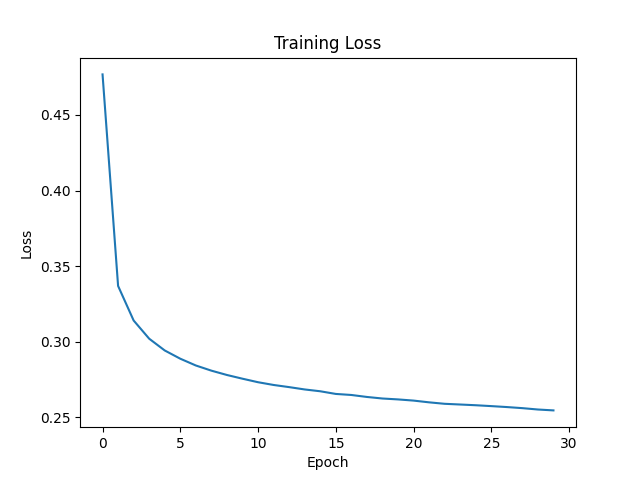

## Logic Regression逻辑回归

### 数学原理
* 它假设输入特征 $X$（784维像素值）和输出类别 $Y$ 的 **对数几率（Log-odds）** 呈线性关系。
* 对于 MNIST 这种多分类（10类）问题，使用 Softmax 函数将线性加权和 $z = Wx + b$ 压缩成一个概率分布：
$$P(Y=k|X) = \frac{e^{(z_k - z_{max})}}{\sum_{j} e^{(z_j - z_{max})}}$$
* **损失函数**：使用 **交叉熵损失（Cross-Entropy Loss）**，通过梯度下降法（SGD/Adam）最小化预测概率分布与真实分布之间的差异。

### 几何意义
* 它在 784 维空间中切了 10 刀（超平面），决策边界是线性的。它试图让所有样本点被正确分类的概率最大化。


### 实现框架
* 数据预处理只需要进行归一化（将像素值从 0-255 缩放到 0-1）
* 前向传播：`z = X * W + b` => `P(y|X) = SoftMax(z)`
* 计算损失（交叉熵损失函数）：`loss = -log(P(y=Y|X)`，也就是找到真实类别对应的那一个预测概率，取对数。概率越接近1，损失越接近0；概率越低，损失越大。
* 反向传播：`error = P(y|X) - one-hot` => `W = W - α * X @ error`, `b = b - α * sum(error)`
* 训练参数：
    ```
    learning_rate = 0.1
    epochs = 30      # 训练轮数
    batch_size = 64  # 采用小批量梯度下降 (Mini-batch)来更新参数
    ```

### 训练结果

* 准确率能达到 **92.5%**
* **局限**：因为手写数字是非线性的（例如数字 "0" 是一个圈，线性模型很难切分这种拓扑结构），逻辑回归的能力受限于其线性本质。
```
Epoch 1/30 - Loss: 0.4768 - Test Acc: 0.9080
Epoch 2/30 - Loss: 0.3369 - Test Acc: 0.9141
Epoch 3/30 - Loss: 0.3141 - Test Acc: 0.9174
Epoch 4/30 - Loss: 0.3021 - Test Acc: 0.9181
Epoch 5/30 - Loss: 0.2943 - Test Acc: 0.9199
Epoch 6/30 - Loss: 0.2888 - Test Acc: 0.9198
Epoch 7/30 - Loss: 0.2844 - Test Acc: 0.9203
Epoch 8/30 - Loss: 0.2809 - Test Acc: 0.9212
Epoch 9/30 - Loss: 0.2781 - Test Acc: 0.9233
Epoch 10/30 - Loss: 0.2756 - Test Acc: 0.9231
Epoch 11/30 - Loss: 0.2733 - Test Acc: 0.9225
Epoch 12/30 - Loss: 0.2715 - Test Acc: 0.9222
Epoch 13/30 - Loss: 0.2701 - Test Acc: 0.9228
Epoch 14/30 - Loss: 0.2685 - Test Acc: 0.9253
Epoch 15/30 - Loss: 0.2673 - Test Acc: 0.9240
Epoch 16/30 - Loss: 0.2655 - Test Acc: 0.9243
Epoch 17/30 - Loss: 0.2649 - Test Acc: 0.9248
Epoch 18/30 - Loss: 0.2636 - Test Acc: 0.9243
Epoch 19/30 - Loss: 0.2625 - Test Acc: 0.9233
Epoch 20/30 - Loss: 0.2619 - Test Acc: 0.9221
Epoch 21/30 - Loss: 0.2611 - Test Acc: 0.9248
Epoch 22/30 - Loss: 0.2600 - Test Acc: 0.9242
Epoch 23/30 - Loss: 0.2590 - Test Acc: 0.9228
Epoch 24/30 - Loss: 0.2586 - Test Acc: 0.9238
Epoch 25/30 - Loss: 0.2581 - Test Acc: 0.9236
Epoch 26/30 - Loss: 0.2575 - Test Acc: 0.9231
Epoch 27/30 - Loss: 0.2569 - Test Acc: 0.9250
Epoch 28/30 - Loss: 0.2562 - Test Acc: 0.9233
Epoch 29/30 - Loss: 0.2553 - Test Acc: 0.9247
Epoch 30/30 - Loss: 0.2547 - Test Acc: 0.9256
```


---

## 线性支持向量机(Support Vector Machine)

### 数学原理
* SVM 不关心概率，只关心**分类决策**。试图找到一个超平面 $w^T x + b = 0$，使得正负样本离这个平面的距离（**间隔 Margin**）最大化。它是一个 **凸二次规划（Convex Quadratic Programming, QP）** 优化问题。
* **目标函数**：**Hinge Loss**（合页损失）（结构风险最小化 = 最大间隔 + 最小化分类错误）。
$$\min (\frac{1}{2}||w||^2 + C \sum \xi_i)$$

* 这意味着只要样本被正确分类且离边界足够远，它就不产生损失（相比之下，逻辑回归即使分对了，只要概率不是1，依然有微小损失）。

* **约束条件**：$y_i(w^T x_i + b) \geq 1 - \xi_i$


### 几何意义
* 同样是切几刀线性超平面，但线性 SVM 切得更“稳”。
* 它由少数 **支持向量（Support Vectors）** 决定边界，对非边界的噪声点不敏感（鲁棒性更强）。

### 实现框架
* 数据预处理只需要进行归一化（将像素值从 0-255 缩放到 0-1）
* 我们调用 `scikit-learn` 库的LinearSVC实现。它底层采用坐标下降法优化，在每一步迭代中，选择 $w$ 的一个分量 $w_k$ 进行优化，而将其他分量固定。
* 训练参数：
    ```
    C=1.0         # 惩罚系数
    gamma="scale" # 控制高斯核“山包”的尖锐程度
    max_iter=2000 # 最大迭代次数（确保收敛）
    ```

### 训练结果
* 准确率达到 **91.8%**
* **局限**：虽然线性SVM的泛化能力理论上比逻辑回归好，但受限于线性模型的表达能力，依然无法处理复杂的像素组合特征。
```
初始化分类器: Mode=linear, C=1.0, Use HOG=False
训练集样本数: 60000, 测试集样本数: 10000
开始训练 (linear)...
训练完成！耗时: 24.09 秒
正在评估 (linear)...
------------------------------
模式: linear
测试集准确率: 0.9183
------------------------------
```


---
## 高斯核支持向量机(Support Vector Machine)

### 数学原理
* **核技巧 (Kernel Trick)**：这是它与前两者的本质区别。它不直接在 784 维空间做线性分割，而是利用高斯核函数 $K(x, y) = \exp(-\gamma ||x-y||^2)$ 计算样本间的相似度。

* **隐式升维**：数学上可以证明，高斯核相当于将数据映射到了无限维的特征空间。
* **Cover定理**：将低维不可分的数据映射到高维空间后，它们线性可分的概率趋近于 1。

### 几何意义
* 在原始 784 维空间看，它的决策边界是高度非线性的（可以是弯曲的、封闭的圈等）。
* 直观理解：它类似于“模板匹配”或“局部加权”。它在每个支持向量周围建立“势力范围”（高斯分布山包），新样本离谁近就归谁。

### 实现框架
* 数据预处理：
    * 归一化(Normalization：将像素值从 0-255 缩放到 0-1)/标准化(Standardization：将数据特征缩放成均值为0、标准差为1)
    * **提取 HOG 特征**
    * **PCA 降维**：将维度从 784 降至 200 左右，大大提高RBF核SVM的计算效率。

* 我们还是调用 `scikit-learn` 库来实现，其底层使用 **SMO 算法 (Sequential Minimal Optimization)**。
    * **SMO 的核心思想**：将一个包含 $N$ 个变量（$\alpha_1, \dots, \alpha_N$）的巨大 QP 问题，分解成许多只包含两个变量的微型 QP 问题。
    * 迭代过程：在每一步迭代中，SMO 只选择两个 $\alpha_i, \alpha_j$ 进行优化，而将其他 $\alpha$ 变量视为固定常数。

* 训练参数：
    ```
    C=50.0         # 惩罚系数
    gamma="scale"  # 控制高斯核“山包”的尖锐程度
    max_iter=20000 # 最大迭代次数（确保收敛）
    use_hog=True   # 启用 HOG 特征
    hog_orientations=9
    hog_pixels_per_cell=(4, 4)
    hog_cells_per_block=(2, 2)
    pca_components=200 # PCA 降维后的维度数
    ```

### 训练结果
* 原始像素可达 **98.4%**，加 HOG 特征可达 **99%+**
* **优势**：完美捕捉了手写数字的非线性拓扑结构（如圆弧、转折）
* trade-off：通过PCA降维，在保留数据中最大方差的前提下，将高维特征空间投影到一个低维子空间，从而显著降低计算量。
```
初始化分类器: Mode=rbf, C=50.0, Use HOG=True
训练集样本数: 60000, 测试集样本数: 10000
正在提取 HOG 特征 (Orientations=9, Pixels per Cell=(4, 4), Cells per Block=(2, 2))...
HOG 特征提取完成，维度: 1296
正在提取 HOG 特征 (Orientations=9, Pixels per Cell=(4, 4), Cells per Block=(2, 2))...
HOG 特征提取完成，维度: 1296
HOG 特征数据维度: 训练集 (60000, 1296), 测试集 (10000, 1296)
应用 PCA 降维到 200 维...
PCA 降维完成！保留的累计方差：0.9096
开始训练 (rbf)...
训练完成！耗时: 12.10 秒
正在评估 (rbf)...
------------------------------
模式: rbf
测试集准确率: 0.9899
------------------------------
```

---
## 决策树(Decision Tree)

### 数学原理
* **信息论基础**：决策树通过递归地分割数据，试图降低节点的不纯度（Impurity）。
* **分裂标准**：
    * **信息增益 (Information Gain)**：基于熵 (Entropy) $H(D) = -\sum p_i \log_2 p_i$。选择能让熵下降最快（信息增益最大）的特征进行分裂。
    * **基尼系数 (Gini Impurity)**：$Gini(D) = 1 - \sum p_i^2$。
* **预测**：遍历树结构，落入叶子节点的样本被归为该叶子中占多数的类别。

### 几何意义
* 它在 784 维空间中进行**正交切割**（Axis-aligned splits）。
* 决策边界是由许多垂直于坐标轴的超平面组成的 **阶梯状（锯齿状）** 表面。
* 相比于线性模型的“一刀切”，决策树可以切出封闭的、不规则的区域，但对于斜向的边界（如 $x_1 + x_2 > 0$）需要切很多刀来逼近，效率较低。

### 实现框架
* **PCA 降维**：这是关键步骤。原始像素特征相关性强且维度高，直接训练决策树容易过拟合且效率低。PCA 将数据旋转到方差最大的方向，使决策树的“正交切割”更有效。
* 调用 `sklearn.tree.DecisionTreeClassifier`。
* **防过拟合策略**：通过限制树深度 (`max_depth`) 和分裂最小样本数 (`min_samples_split`) 来防止死记硬背。
* 训练参数：
    ```python
    criterion='entropy'   # 使用信息增益
    max_depth=20          # 剪枝
    min_samples_split=20  # 预剪枝
    pca_components=0.85   # 保留 85% 的方差信息
    ```

### 训练结果
* 准确率约为 **85%**。
* **优势**：简单、快速
* **局限**：单棵树极易过拟合，对训练数据的微小变化非常敏感（高方差）；且难以捕捉图像中的平移、旋转不变性。
* **改进**：使用 **随机森林 (Random Forest)** 集成多棵树，准确率通常可提升至 95% 以上。
```
正在加载数据: mnist_all.mat ...
数据加载完成: 训练集 (60000, 784), 测试集 (10000, 784)
应用 PCA 降维 (components=0.85)...
PCA 完成，保留的累计方差: 0.8502
降维后特征维度: 59
开始训练决策树 (Criterion=entropy, Max Depth=20)...
训练完成！耗时: 7.73 秒
正在评估...
------------------------------
测试集准确率: 0.8513
------------------------------
```


---
## Bagging 集成学习 (Bootstrap Aggregating)

### 数学原理
* Bagging 是一种集成学习方法，通过对数据集进行多次自助采样（Bootstrap Sampling），训练多个基分类器（如决策树），并通过投票或平均的方式结合这些分类器的预测结果。
* 其核心思想是通过减少模型的方差（Variance）来提升整体模型的泛化能力。
* 数学公式：
$$
\hat{f}(x) = \frac{1}{M} \sum_{m=1}^M f_m(x)
$$
其中：$ M $ 是基分类器的数量，$ f_m(x) $ 是第 m 个基分类器的预测结果

### 几何意义
* Bagging 的几何意义在于通过多个分类器的组合，减少单个分类器的偏差和方差。
* 每个基分类器在不同的样本和特征子集上训练，最终的集成模型能够更稳定地拟合数据分布，避免过拟合。
* 在特征空间中，Bagging 的决策边界是多个基分类器决策边界的综合，表现为更平滑、更鲁棒的分类边界。

### 实现框架
* **数据预处理**：对像素值进行归一化（0-255 缩放到 0-1），并使用 PCA 降维保留 85% 的累计方差。
* **基分类器**：使用决策树作为基分类器，并通过以下随机性增强多样性：
    - 随机设置最小分裂样本数（`min_samples_split`）
    - 随机选择样本子集（`max_samples`）
    - 随机选择特征子集（`max_features`）
* 调用 `sklearn.ensemble.BaggingClassifier` 实现 Bagging，基分类器为决策树。
* **训练参数**：
    ```python
    n_estimators=100          # 基分类器数量
    max_depth=25              # 决策树最大深度
    max_samples=0.5~1.0       # 随机选择样本比例
    max_features=0.5~1.0      # 随机选择特征比例
    bootstrap=True            # 自助采样
    pca_components=0.85       # PCA 降维

    # 基分类器采用单棵决策树
    base_dt = DecisionTreeClassifier(
        max_depth=self.max_depth,
        criterion='gini',
        min_samples_split=random.randint(10, 20),
        random_state=None # 注意：这里不要固定随机种子，否则每棵树都一样了！
    )
    ```

### 训练结果
* 准确率约为 **96.06%**
```
正在加载数据: mnist_all.mat ...
数据加载完成: 训练集 (60000, 784), 测试集 (10000, 784)
正在提取 HOG 特征 (Orientations=9, Pixels per Cell=(4, 4), Cells per Block=(2, 2))...
HOG 特征提取完成，维度: 1296
HOG 特征数据维度: (60000, 1296)
应用 PCA 降维 (components=0.85)...
PCA 完成，保留的累计方差: 0.8509
降维后特征维度: 148
开始并行训练 100 个基模型 (n_jobs=-1)...
训练完成！耗时: 71.42 秒
正在提取 HOG 特征 (Orientations=9, Pixels per Cell=(4, 4), Cells per Block=(2, 2))...
HOG 特征提取完成，维度: 1296
正在评估...
------------------------------
测试集准确率: 0.9606
------------------------------
```

---

## AdaBoost 集成学习 (Adaptive Boosting)

### 数学原理

* AdaBoost 是一种迭代式的集成学习方法，通过串行训练多个弱分类器（Weak Learners）。每一轮训练都会增加前一轮被错误分类样本的权重，使新的分类器更加关注这些“困难样本”。
* 其核心思想是通过逐步减小模型的**偏差（Bias）**来提升整体性能（与 Bagging 主要降低方差不同），将多个弱分类器组合成一个强分类器。
* 数学公式：$$F(x) = \sum_{m=1}^M \alpha_m f_m(x)$$
其中：$ M $ 是迭代次数，$ f_m(x) $ 是第 m 个弱分类器，$\alpha\_m$ 是该分类器的权重（取决于其准确率，准确率越高权重越大）。

### 几何意义
* AdaBoost 的几何意义在于通过加权组合，在特征空间中构建一个高度非线性的复杂决策边界。
* 每一轮迭代产生的决策边界都是对上一轮边界的“修补”：第一个分类器切一刀，第二个分类器去切第一个切错的地方，以此类推。
* 最终的决策边界类似于多面体的组合，能够非常精细地拟合数据分布中复杂的非凸区域（即那些容易混淆的边缘样本）。

### 实现框架
* **数据预处理**：推荐使用 HOG 特征提取以保留局部形状信息；移除 PCA 降维（直接使用高维特征），让 AdaBoost 自动筛选对分类最有用的特征组合。
* **基分类器**：通常使用深度较浅的决策树（Decision Stump 或 Depth=10 左右），强调“弱”但“有差异”：
    * 每一轮的数据集权重不同（错误样本权重高）。
    * 树的生长受限于最大深度，防止单棵树过拟合。

* **训练参数**：
    ```python
    n_estimators=200              # 迭代次数（需配合较小的学习率）
    learning_rate=0.2             # 学习率（收缩系数，防止过快拟合噪音）
    algorithm='SAMME.R'           # 使用概率预测更新权重（收敛更快）

    # 基分类器采用稍深一点的决策树（增强单体能力）
    base_dt = DecisionTreeClassifier(
        max_depth=10,             # 相比 Bagging，这里通常限制深度
        criterion='gini',
        splitter='best',          # 每次分裂都寻找最优切分点
        random_state=None 
    )
    ```

### 训练结果
* 准确率约为 **98.35%**
```
正在加载数据: mnist_all.mat ...
数据加载完成: 训练集 (60000, 784), 测试集 (10000, 784)
正在提取 HOG 特征 (Orientations=9, Pixels per Cell=(4, 4), Cells per Block=(2, 2))...
HOG 特征提取完成，维度: 1296
HOG 特征数据维度: (60000, 1296)
开始训练 AdaBoost 模型 (n_estimators=200, learning_rate=0.2)...
训练完成！耗时: 4770.69 秒
正在提取 HOG 特征 (Orientations=9, Pixels per Cell=(4, 4), Cells per Block=(2, 2))...
HOG 特征提取完成，维度: 1296
正在评估...
------------------------------
测试集准确率: 0.9835
------------------------------
```